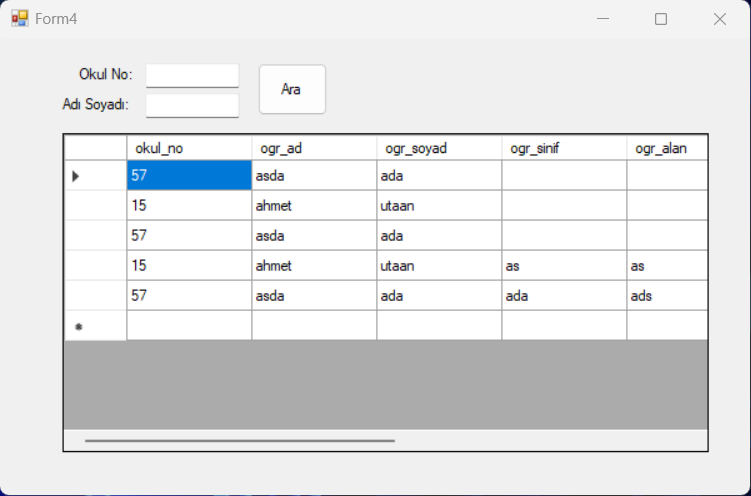

# C# ile Ogrenci Kayit Sistemi
- ### Giriş için veritabanından kayıtlı kullanıcıların kullanıcı adı ve şifresi ile giriliyor.

***
- ### Form yönlendirme bölümü

***

- ### Öğrenci not verme bölümü

***

- ### Öğrenci kayıt bölümü 

***

- ### Öğrenci bilgileri arama bölümü

***

## Not= Bilgilerin hepsi veri tabanına kayıt ediliyor ve istenildiği zaman kayıt etme silme ve düzenleme işlemi yapılabiliyor.